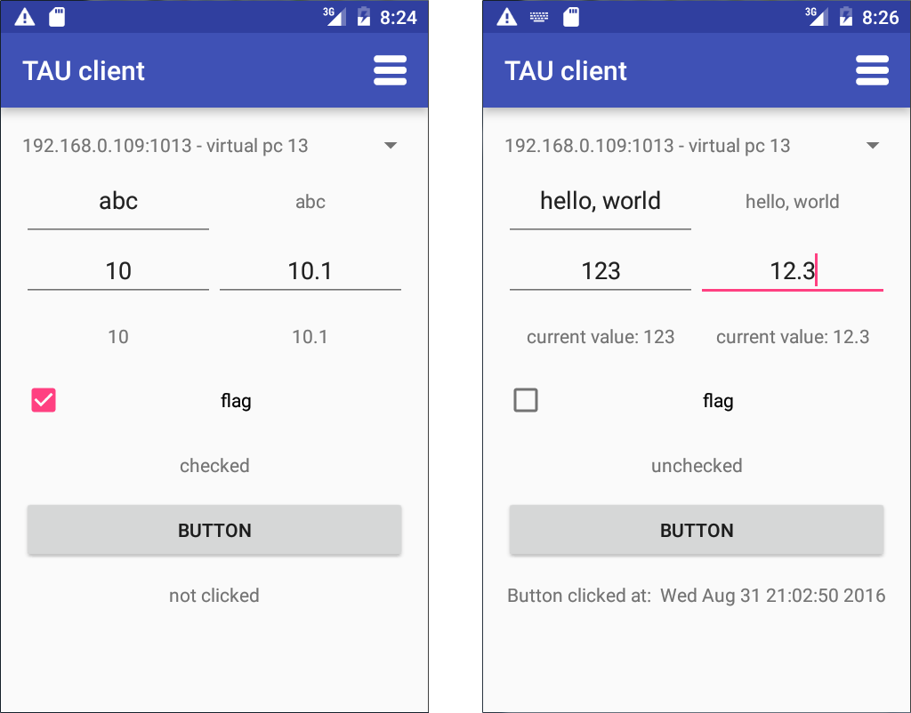
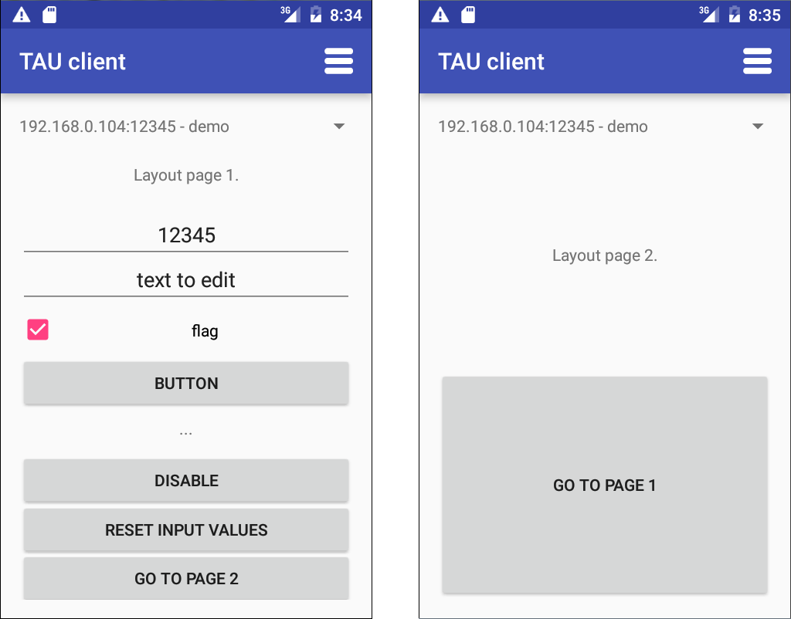

# Introduction to `tau` library

This introduction is aimed to demonstrate the basic principals of the library usage. The most code samples here use [boost.asio](http://www.boost.org/doc/libs/1_61_0/doc/html/boost_asio/overview.html) library to implement socket I/O. The description on how to implement your custom I/O logic is also provided in this document (see the [getting rid of boost dependency](#getting-rid-of-boost-asio-dependency) section).

*Note that here, as everywhere else around this documentation, the `tau` library is used in header-only mode (see the difference between header-only and compiled modes in the [installation](installation.md) reference). The location of the library source files is passed to the compiler as `-I` command line parameter.*

### <a name="hello-world"></a> Hello, world
Let's create simplest application with `tau` library.

The purpose of this tutorial is to show how to create the most basic program that uses `tau` library. Also, the tutorial gives instructions on how to build the program, run it, and how to connect to it with the client device.

All the code in this and all other examples will be contained in one file - `main.cpp`. Frist, all the needed headers are included:
```c++
#include <tau/layout_generation/layout_info.h>
#include <tau/util/basic_events_dispatcher.h>
#include <tau/util/boost_asio_server.h>
```

*Note, that since the example uses boost for socket I/O the boost_asio_server.h is included. This header has the implementation of all the networking logic needed for our application on top of `boost::asio`.*

Next, let's create a simple class that will handle callbacks from events, created by clients. The simplest way to do it is to use `BasicEventsDispatcher` class from `tau::util` namespace as a base class for it:

```c++
class MyEventsDispatcher : public tau::util::BasicEventsDispatcher
{
public:
    MyEventsDispatcher(
        tau::communications_handling::OutgiongPacketsGenerator & outgoingGeneratorToUse): 
            tau::util::BasicEventsDispatcher(outgoingGeneratorToUse)
        {};

    virtual void packetReceived_requestProcessingError(
		std::string const & layoutID, std::string const & additionalData)
    {
        std::cout << "Error received from client:\nLayouID: "
			<< layoutID << "\nError: " << additionalData << "\n";
    }

    virtual void onClientConnected(
        tau::communications_handling::ClientConnectionInfo const & connectionInfo)
    {
        std::cout << "Client connected: remoteAddr: "
            << connectionInfo.getRemoteAddrDump()
            << ", localAddr : "
            << connectionInfo.getLocalAddrDump() << "\n";
    }
    void packetReceived_clientDeviceInfo(
        tau::communications_handling::ClientDeviceInfo const & info)
    {
        using namespace tau::layout_generation;
        std::cout << "Received client information packet\n";
        std::string greetingMessage = "Hello, world!";
        sendPacket_resetLayout(LayoutInfo().pushLayoutPage(
            LayoutPage(tau::common::LayoutPageID("FIRST_LAYOUT_PAGE"),
            LabelElement(greetingMessage))).getJson());
    }
};
```

In the main() function is used to set up the communication abstractions, initialize the user objects:
```c++

int main(int argc, char ** argv)
{
    boost::asio::io_service io_service;
    short port = 12345;
    tau::util::SimpleBoostAsioServer<MyEventsDispatcher>::type s(io_service, port);
    std::cout << "Starting server on port " << port << "...\n";
    s.start();
    std::cout << "Calling io_service.run()\n";
    io_service.run();
    return 0;
}
```

Our program is ready. Let's build it. To build this example we will need to provide the compiler with:
 - libraries needed by `boost::asio`
 - additional include path pointing to the directory with `tau` library source code
 - macro definitions for the `tau` library (for enabling header-only mode and C++03 compatibility)

This is how to do it with the `gcc` compiler:
```sh
g++ -lboost_system -pthread -lboost_thread -D TAU_HEADERONLY -D TAU_CPP_03_COMPATIBILITY -I $LIBRARY_LOCATION main.cpp -o demo
```
So, the notable compiler options are:
 - `-lboost_system -pthread -lboost_thread` - libraries needed by the `boost::asio` library
 - `-D TAU_HEADERONLY` - special macro, telling that the library is built in header-only mode
 - `-D TAU_CPP_03_COMPATIBILITY` - this is the macro that allows to use pre - C++11 compilers on the `tau` library. For more details on this macro see [installation](installation.md#cpp11-vs-cpp03) section
- `-I $LIBRARY_LOCATION` - path to the `tau` library code. It should be replaced to the valid path on the machine, where the compilation is done

After compilation is finished, run the executable:
```
>./demo
Starting server on port 12345...
Calling io_service.run()
```

Now we need to run the client app on the phone or tablet and connect it to the port 12345 of the server. The connection should be established and the client will display this on the screen:


This concludes our first demo application of the `tau` library. Full source for this sample can be found at: [samples/hello_world/boost_asio/main.cpp](samples/hello_world/boost_asio/main.cpp).

### <a name="ui-elems-demo"></a> Demo of the UI elements

The 'hello, world' server in the tutorial above didn't do anything useful, so let's expand it here.

This demo is aimed to show how to work with different UI elements. The server here preforms operation with all the common types of elements: different types of inputs, buttons, labels, containers.

The example code is based on the [Hello, world](#hello-world) example above. All the modifications will affect the `MyEventsDispatcher` class - the rest of the code will not change.

First, let's extend our layout. It should contain all the types of layout elements on one page, so that client could interact with all of them at once. Since, the server will be interacting with the elements on client, we should define IDs for them.

The IDs for the layout elements are stored as hard-coded global variables:

```c++
    tau::common::ElementID const ID_ELEM_BUTTON("ELEM_BUT");
    tau::common::ElementID const ID_ELEM_BOOL_INPUT("ELEM_BOOL");
    tau::common::ElementID const ID_ELEM_INT_INPUT("ELEM_INT");
    tau::common::ElementID const ID_ELEM_FLOAT_INPUT("ELEM_FLOAT");
    tau::common::ElementID const ID_ELEM_TEXT_INPUT("ELEM_TXT");
    tau::common::ElementID const ID_INFO_LABEL_BUTTON("LBL_BUT");
    tau::common::ElementID const ID_INFO_LABEL_BOOL_INPUT("LBL_BOOL");
    tau::common::ElementID const ID_INFO_LABEL_INT_INPUT("LBL_INT");
    tau::common::ElementID const ID_INFO_LABEL_FLOAT_INPUT("LBL_FLOAT");
    tau::common::ElementID const ID_INFO_LABEL_TEXT_INPUT("LBL_TXT");
```

Since the layout object is getting quite big, let's add separate layout generation method.

```c++
    std::string generateLayout(bool notifyServerAboutEdits) {
        using namespace tau::layout_generation;
        UnevenlySplitElementsPair topmostLayoutElement(
            EvenlySplitLayoutElementsContainer(false)
                    .push(TextInputLayoutElement().ID(ID_ELEM_TEXT_INPUT).shouldNotifyOnEdit(notifyServerAboutEdits).initialValue("abc"))
                    .push(LabelElement("abc").ID(ID_INFO_LABEL_TEXT_INPUT)),
            EvenlySplitLayoutElementsContainer(true)
                .push(EvenlySplitLayoutElementsContainer(false)
                    .push(NumberInputLayoutElement(10).allowFloatPoint(false).ID(ID_ELEM_INT_INPUT).shouldNotifyOnEdit(notifyServerAboutEdits))
                    .push(NumberInputLayoutElement(10.1).allowFloatPoint(true).ID(ID_ELEM_FLOAT_INPUT).shouldNotifyOnEdit(notifyServerAboutEdits)))
                    .push(EvenlySplitLayoutElementsContainer(false)
                        .push(LabelElement("10").ID(ID_INFO_LABEL_INT_INPUT))
                        .push(LabelElement("10.1").ID(ID_INFO_LABEL_FLOAT_INPUT)))
                .push(BooleanInputLayoutElement(true).note("flag").ID(ID_ELEM_BOOL_INPUT).shouldNotifyOnEdit(notifyServerAboutEdits))
                .push(LabelElement("checked").ID(ID_INFO_LABEL_BOOL_INPUT))
                .push(ButtonLayoutElement().note("button").ID(ID_ELEM_BUTTON))
                .push(LabelElement("not clicked").ID(ID_INFO_LABEL_BUTTON))
                .push(EmptySpace()),
            true, 0.15);
        return LayoutInfo().pushLayoutPage(LayoutPage(tau::common::LayoutPageID("FIRST_LAYOUT_PAGE"), topmostLayoutElement)).getJson();
    }; 

```
And call it in the `packetReceived_clientDeviceInfo()` callback method:
```c++
    virtual void packetReceived_clientDeviceInfo(tau::communications_handling::ClientDeviceInfo const & info) {
        sendPacket_resetLayout(generateLayout(true));
    };
```

For processing event notifications from client, several more callbacks in `MyEventsDispatcher` class should be overloaded:

 - `packetReceived_buttonClick`
 - `packetReceived_boolValueUpdate`
 - `packetReceived_intValueUpdate`
 - `packetReceived_floatPointValueUpdate`
 - `packetReceived_textValueUpdate`

For the purposes of demonstration, each event will also trigger a server operation, which will update the UI state on the client. Since there are `LabelElement`s next to each of the input elements, the server will update text inside these labels.

The label next to the button will contain information about the time of the last button click:
```c++
    virtual void packetReceived_buttonClick(tau::common::ElementID const & buttonID) {
        std::cout << "event: buttonClick, id=" << buttonID << "\n";
        std::stringstream labelText;
        labelText << "Button clicked at:  " << getDaytimeString();
        sendPacket_changeElementNote(ID_INFO_LABEL_BUTTON, labelText.str());
    };
```
*The `getDaytimeString()` is a utility function that is also implemented in this file.*
 
For the input layout elements the label text will mirror the state of the input. Here is the implementation for the boolean input:

```c++
    virtual void packetReceived_boolValueUpdate(tau::common::ElementID const & inputBoxID, bool new_value, bool is_automatic_update) {
        std::cout << "event: boolValueUpdate, id=" << inputBoxID << ", new value=" << new_value << "\n";
        sendPacket_changeElementNote(ID_INFO_LABEL_BOOL_INPUT, new_value ? "checked" : "unchecked");
    };
```
Similar code is in `packetReceived_intValueUpdate()`, `packetReceived_floatPointValueUpdate()`, `packetReceived_textValueUpdate()` overloads.

After client connects to the server we should see the following layout displayed:



On each modification of data in the input elements on the left, the label next to it will refresh it's value. This is possible because when there is a change of the input layout element's value, the notification packet is sent from client to the server. This behavior is determined by the boolean parameter in the `generateLayout()` method. If, instead of `true`, we pass `false` to it, the notifications would not be sent. In this case the server will have to request variables data explicitly (by sending a special request packet).

This will be demonstrated in the next section. The code for this demo can be found at [samples/ui_elements_demo/boost_asio/main.cpp](samples/ui_elements_demo/boost_asio/main.cpp)

### <a name="server-requests-demo"></a> Server requests demo

The previous example showed how the server program could modify the text for the labels on the client's screen. There are several other operations that server could do on client. These operations are:
 - request values of the inputs at any moment (boolean, numeric, text inputs)
 - modify the values of these inputs
 - order the client to change the currently displayed layout page
 - modify the read-only text on the layout elements (buttons, labels, boolean input elements)
 - change the `isEnabled` attribute of the input elements. When it is set to `false` for some element, the user will not be able to interact with this element.

All these operations are preformed in this demo.

First, the constants are declared for the layout elements and pages IDs:
```c++
    tau::common::LayoutPageID const LAYOUT_PAGE_1("FIRST_LAYOUT_PAGE");
    tau::common::LayoutPageID const LAYOUT_PAGE_2("SECOND_LAYOUT_PAGE");
    tau::common::ElementID const BOOLEAN_INPUT("BOOL_INP");
    tau::common::ElementID const NUMERIC_INPUT("NUM_INP");
    tau::common::ElementID const TEXT_INPUT("TXT_INP");
    tau::common::ElementID const BUTTON_ELEMENT("BUTTON");
    tau::common::ElementID const BUTTON_ENABLE_DISABLE("BUTTON_ENABLE_DISABLE");
    tau::common::ElementID const LABEL_ELEMENT("LABEL");
    tau::common::ElementID const BUTTON_GO_TO_SECOND_PAGE("BUTTON_GO_TO_SECOND");
    tau::common::ElementID const BUTTON_GO_TO_FIRST_PAGE("BUTTON_GO_TO_FIRST");
    tau::common::ElementID const BUTTON_RESET_VALUES("BUTTON_RESET_VALUES");
```

Then, as usual, let's create a layout json and send it to the client in `packetReceived_clientDeviceInfo()` method:

```c++
    virtual void packetReceived_clientDeviceInfo(tau::communications_handling::ClientDeviceInfo const & info) {
        using namespace tau::layout_generation;
        UnevenlySplitElementsPair layout_page_1(
            LabelElement("Layout page 1."), 
            EvenlySplitLayoutElementsContainer(false)
                .push(EvenlySplitLayoutElementsContainer(true)
                    .push(NumberInputLayoutElement(12345).allowFloatPoint(false).ID(NUMERIC_INPUT).shouldNotifyOnEdit(false))
                    .push(TextInputLayoutElement().ID(TEXT_INPUT).initialValue("text to edit").shouldNotifyOnEdit(false))
                    .push(BooleanInputLayoutElement(true).note("flag").ID(BOOLEAN_INPUT).shouldNotifyOnEdit(false))
                    .push(ButtonLayoutElement().note("button").ID(BUTTON_ELEMENT))
                    .push(LabelElement("...").ID(LABEL_ELEMENT))
                    .push(ButtonLayoutElement().note("disable").ID(BUTTON_ENABLE_DISABLE))
                    .push(ButtonLayoutElement().note("reset input values").ID(BUTTON_RESET_VALUES))
                    .push(ButtonLayoutElement().note("go to page 2").ID(BUTTON_GO_TO_SECOND_PAGE))
                    ),
            true, 0.15);
        UnevenlySplitElementsPair layout_page_2(
            LabelElement("Layout page 2."), 
            ButtonLayoutElement().note("go to page 1").ID(BUTTON_GO_TO_FIRST_PAGE), true, 0.5);
            
        sendPacket_resetLayout(LayoutInfo()
            .pushLayoutPage(LayoutPage(LAYOUT_PAGE_1, layout_page_1))
            .pushLayoutPage(LayoutPage(LAYOUT_PAGE_2, layout_page_2)).setStartLayoutPage(LAYOUT_PAGE_1).getJson());
    }
```

*Please note, that in this demo we are using a layout with 2 layout pages. Among other things, this demo will show how to switch between them.*

All the demonstrated operations are done inside the `packetReceived_buttonClick` event handler. Depending on the button pressed, it preforms specific operations, which change the state of the UI displayed on the client.

```c++
 virtual void packetReceived_buttonClick(tau::common::ElementID const & buttonID) {
        std::cout << "event: buttonClick, id=" << buttonID << "\n";
        if (buttonID == BUTTON_ELEMENT) {
            std::string datetime = getDaytimeString();
            sendPacket_changeElementNote(BOOLEAN_INPUT, datetime);
            sendPacket_changeElementNote(BUTTON_ELEMENT, datetime);
            sendPacket_changeElementNote(LABEL_ELEMENT, datetime);
            std::cout << "Requesting the current values in the input controls...\n";
            sendPacket_requestValue(BOOLEAN_INPUT);
            sendPacket_requestValue(NUMERIC_INPUT);
            sendPacket_requestValue(TEXT_INPUT);
        } else if (buttonID == BUTTON_ENABLE_DISABLE) {
            m_enabled = !m_enabled;
            sendPacket_changeElementEnabledState(BUTTON_ELEMENT, m_enabled);
            sendPacket_changeElementEnabledState(BOOLEAN_INPUT, m_enabled);
            sendPacket_changeElementEnabledState(NUMERIC_INPUT, m_enabled);
            sendPacket_changeElementEnabledState(TEXT_INPUT, m_enabled);
            sendPacket_changeElementNote(BUTTON_ENABLE_DISABLE, m_enabled ? "disable" : "enable");
        } else if (buttonID == BUTTON_GO_TO_FIRST_PAGE) {
            sendPacket_changeShownLayoutPage(LAYOUT_PAGE_1);
        } else if (buttonID == BUTTON_GO_TO_SECOND_PAGE) {
            sendPacket_changeShownLayoutPage(LAYOUT_PAGE_2);
        } else if (buttonID == BUTTON_RESET_VALUES) {
            sendPacket_updateBooleanValue(BOOLEAN_INPUT, true);
            sendPacket_updateIntValue(NUMERIC_INPUT, 10);
            sendPacket_updateTextValue(TEXT_INPUT, "default text");
        } else {
            assert(false); //unreachable code
        }
    }
```

The UI on client for this server looks like this:



The code for this demo can be found at [samples/server_requests_demo/boost_asio/main.cpp](samples/server_requests_demo/boost_asio/main.cpp)

### <a name="getting-rid-of-boost-asio-dependency"></a> Getting rid of `boost` dependency
Let's now implement the socket I/O ourselves. The aim of this tutorial is to show basic principals, on which the the I/O subsystem for `tau` library should be written. 

This tutorial will implement socket I/O for POSIX sockets API. All the I/O code will be located inside `main()` method. The server will be the simplest possible server: it will wait for the one client connection, service the client, and after connection is closed, the server will cause the program to exit.

The additional headers that we will need for implementing it (note the 2 headers from `tau` library):

```c++
#include <sys/types.h>
#include <sys/socket.h>
#include <netinet/in.h>
#include <arpa/inet.h>
#include <unistd.h>
#include <tau/communications_handling/outgiong_packets_generator.h>
#include <tau/communications_handling/incoming_data_stream_parser.h>

```

In the `main()` function, let's create a socket and listen on it:

```c++
    int socket_handle = socket(AF_INET, SOCK_STREAM, 0);
    if (socket_handle == -1) {
        std::cerr << "Can't create the socket. Exiting.\n";
        return -1;
    }
    std::cout << "Socket created. ";
    int listenPort = 12345;
    sockaddr_in serverAddr;
    serverAddr.sin_family = AF_INET;
    serverAddr.sin_addr.s_addr = INADDR_ANY;
    serverAddr.sin_port = htons(listenPort);

    if (bind(socket_handle, (sockaddr*)(&serverAddr), sizeof(serverAddr)) < 0) {
        std::cerr << "Can't bind the socket. Exiting.\n";
        return -2;
    }
    std::cout << "bind() succeded. Starting to listen on the socket (port " << listenPort << ")...\n";
    listen(socket_handle, 5);
```

Next is handling of incoming client connection:

```c++
    sockaddr_in client;
    int client_socket_size = sizeof(sockaddr_in);
    int client_handle = accept(socket_handle, (sockaddr*)(&client), (socklen_t*)&client_socket_size);
    if (client_handle < 0) {
        std::cerr << "Accept failed. Exiting.\n";
        return -3;
    }
    std::cout << "Connection accepted.";
```
Now, after the connection is accepted the I/O operations are done. This is the place, where the generic I/O code interfaces with the code inside `BasicEventsDispatcher` class.

To set up this interface, we need to create the implementation of the `OutgiongPacketsGenerator` class. Inside this class the code for sending data to the client is done:

```c++
class MyOutgoingPacketsGenerator : 
    public tau::communications_handling::OutgiongPacketsGenerator
{
    int m_socketHandle;
public:
    MyOutgoingPacketsGenerator(int output_socket_handle): m_socketHandle(output_socket_handle)
    {};
    virtual void sendData(std::string const & data) {
        write(m_socketHandle, data.c_str(), data.size());
    }
};
```

And here is how everything is set up back in `main()` function:
```c++
    MyOutgoingPacketsGenerator outgoingPacketsGenerator(client_handle);
    MyEventsDispatcher myServerLogic(outgoingPacketsGenerator);
    tau::communications_handling::IncomingDataStreamParser incomingDataStreamParser;
    
    tau::communications_handling::ClientConnectionInfo connectionInfo(getAddrString(client), ntohs(client.sin_port), getAddrString(serverAddr), ntohs(serverAddr.sin_port));
    myServerLogic.onClientConnected(connectionInfo); //Notify the user code about the connection details
    
    while((read_bufSize = recv(client_handle, buffer, BUFSIZE, 0)) > 0) {
        std::string received_data(buffer, read_bufSize);
        incomingDataStreamParser.newData(
                received_data, 
                myServerLogic.getIncomingPacketsHandler(), 
                myServerLogic.getCommunicationIssuesHandler()
            );
    }
```

The 3 objects are handling the server logic. `MyEventsDispatcher` - a class that contains all the server code without any knowledge of the underlying I/O primitives. `OutgiongPacketsGenerator`'s responsibility is to provide to the `MyEventsDispatcher` a way of sending data. `IncomingDataStreamParser`'s responsibility is processing all the data read from socket and notifying `MyEventsDispatcher` about the events on the client (through callback mechanism).

Here is how to compile this code: 
```sh
g++ -D TAU_HEADERONLY -D TAU_CPP_03_COMPATIBILITY -I $LIBRARY_LOCATION main.cpp -o demo
```
Note the lack of compiler options for `boost::asio` library (`-lboost_system -pthread -lboost_thread`).

This concludes the tutorial on how to get `tau` code to work with your own socket I/O implementation.

There are implementations of all the samples above with POSIX instead of boost::asio. Here is the table of links to all the samples:

|demo|boost::asio version|POSIX sockets version|
|----|----|----|
|[hello world](samples/hello_world)|[main.cpp](samples/hello_world/boost_asio/main.cpp)|[main.cpp](samples/hello_world/posix/main.cpp)|
|[ui elements demo](samples/ui_elements_demo/)|[main.cpp](samples/ui_elements_demo/boost_asio/main.cpp)|[main.cpp](samples/ui_elements_demo/posix/main.cpp)|
|[server requests demo](samples/server_requests_demo/)|[main.cpp](samples/server_requests_demo/boost_asio/main.cpp)|[main.cpp](samples/server_requests_demo/posix/main.cpp)|
